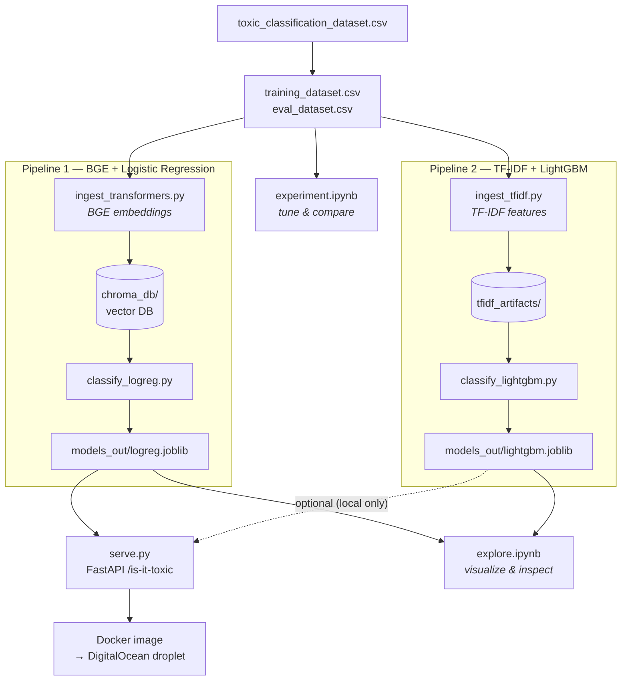

# Is it toxic

This is a learning project for exploring text classification with machine learning.

## Dataset

The `toxic_classification_dataset.csv` classifies comments into two categories:
- `toxic`
- `non_toxic`

We split this into:
- training dataset: `training_dataset.csv`
- eval dataset: `eval_dataset.csv`

Each CSV has two columns: `label,text`.

# Pipelines

There are two separate pipelines this project demonstrates:

| Pipeline | Ingestion (features) | Classifier |
|----------|----------------------|------------|
| 1 | `BAAI/bge-small-en-v1.5` sentence embeddings → Chroma vector DB | Logistic Regression |
| 2 | TF-IDF (scikit-learn) | LightGBM |

## Architecture overview



The deployed container serves **Pipeline 1 only** (the stronger model); the local
API also runs Pipeline 2 for side-by-side comparison.

## Project structure

| Path | What it is |
|------|------------|
| `dataset.py` | Shared `label,text` CSV loader (used by ingestion + notebooks) |
| `ingest_transformers.py` | Pipeline 1 ingestion — BGE embeddings → Chroma |
| `ingest_tfidf.py` | Pipeline 2 ingestion — TF-IDF → `tfidf_artifacts/` |
| `classify_logreg.py` | Pipeline 1 classifier — Logistic Regression |
| `classify_lightgbm.py` | Pipeline 2 classifier — LightGBM |
| `predict.py` | Loads trained models, shared `predict_bge` / `predict_tfidf` |
| `serve.py` | FastAPI app exposing `/is-it-toxic` |
| `explore.ipynb` | Visualize/compare pipelines, plot the classification space |
| `experiment.ipynb` | Self-contained harness to tune models with cross-validation |
| `Dockerfile`, `docker-compose.yml`, `DEPLOY.md` | Serving image + droplet deploy |
| `requirements.txt` / `requirements-serve.txt` | Full dev deps / lean serving deps |

## Setup

```bash
pip install -r requirements.txt
```

The BGE pipeline uses a **local, offline** copy of the model in
`models/bge-small-en-v1.5/` (not committed to git). Ingestion will fail with a
clear error if that directory is missing.

## Quickstart — run every step in order

From a fresh checkout (with `models/bge-small-en-v1.5/` in place), this runs the
whole project end to end. Each step is explained in its own section below.

```bash
# 0. Install dependencies
pip install -r requirements.txt

# 1. Ingest features for BOTH pipelines (train + eval splits)
python ingest_transformers.py                                      # BGE → Chroma (train)
python ingest_transformers.py --dataset eval_dataset.csv --no-reset   # BGE → Chroma (eval)
python ingest_tfidf.py                                             # TF-IDF fit (train)
python ingest_tfidf.py --dataset eval_dataset.csv --transform-only    # TF-IDF transform (eval)

# 2. Train + evaluate the classifiers (writes models_out/*.joblib)
python classify_logreg.py       # Pipeline 1: BGE + Logistic Regression
python classify_lightgbm.py     # Pipeline 2: TF-IDF + LightGBM

# 3. (optional) Explore & experiment
jupyter lab explore.ipynb       # visualize predictions + classification space
jupyter lab experiment.ipynb    # cross-validated tuning / comparison

# 4. Serve the API locally
uvicorn serve:app --reload      # http://127.0.0.1:8000/docs

# 5. (optional) Build & run the deployment container
docker compose up --build       # http://localhost/docs
```

> Steps 1 → 2 must run in order (classification reads what ingestion wrote).
> Step 4 needs step 2 done at least once. See **[DEPLOY.md](DEPLOY.md)** for the
> DigitalOcean droplet walkthrough.

## Training data ingestion

Both ingestion scripts read the same `label,text` CSVs and default to the
training set. Run them once for training and once for eval.

### Pipeline 1 — BGE embeddings → Chroma

```bash
python ingest_transformers.py                                   # training set
python ingest_transformers.py --dataset eval_dataset.csv --no-reset   # eval set
```

This embeds each comment and upserts it into a persistent Chroma collection
(`toxic_comments`) under `chroma_db/`. Each document stores its `label` and
`source` (`training_dataset` / `eval_dataset`) as metadata. Re-running is
idempotent (documents are upserted by a stable id).

### Pipeline 2 — TF-IDF → scikit-learn

```bash
python ingest_tfidf.py                                          # fit on training
python ingest_tfidf.py --dataset eval_dataset.csv --transform-only   # transform eval
```

The vectorizer is **fit only on the training set** (so the vocabulary never
leaks from eval). Artifacts land in `tfidf_artifacts/`:
- `vectorizer.joblib` — the fitted `TfidfVectorizer`
- `<split>_features.npz` — the sparse feature matrix for that split
- `<split>_labels.joblib` — the aligned labels

### Smoke-testing the ingested data

Quick checks that ingestion produced what you expect.

**Chroma (Pipeline 1)** — count documents and peek at a stored record:

```bash
python -c "import chromadb; c=chromadb.PersistentClient(path='chroma_db').get_collection('toxic_comments'); print('total docs:', c.count()); print(c.get(limit=2, include=['metadatas','documents']))"
```

You should see the total document count (99 for train + eval) and a couple of
records with their `label`/`source` metadata.

**TF-IDF (Pipeline 2)** — check the saved matrices load and have matching shapes:

```bash
python -c "import joblib; from scipy.sparse import load_npz; X=load_npz('tfidf_artifacts/training_dataset_features.npz'); y=joblib.load('tfidf_artifacts/training_dataset_labels.joblib'); print('features:', X.shape, 'labels:', len(y))"
```

Rows in the feature matrix should equal the number of labels, and the training
and eval matrices should have the same number of columns (same vocabulary).

## Classification

Each pipeline has its own standalone training/eval script. Run the matching
ingestion first, then:

### Pipeline 1 — Logistic Regression on BGE embeddings

```bash
python classify_logreg.py
```

Reads the training and eval embeddings back out of Chroma, trains a
`LogisticRegression`, prints accuracy + a classification report on the eval set,
and saves the model to `models_out/logreg.joblib`.

### Pipeline 2 — LightGBM on TF-IDF features

```bash
python classify_lightgbm.py
```

Loads the TF-IDF feature matrices, trains an `LGBMClassifier`, prints accuracy +
a classification report on the eval set, and saves the model to
`models_out/lightgbm.joblib`.

## Eval

Both classification scripts report accuracy and a per-class precision/recall/F1
report on `eval_dataset.csv`. Note the eval set is small (20 rows), so treat the
numbers as a rough sanity check rather than a precise benchmark.

## Exploring the pipelines

`explore.ipynb` is a JupyterLab notebook for understanding and comparing the two
pipelines. Launch it with:

```bash
jupyter lab explore.ipynb
```

It has three parts:
1. **Evaluation** — metrics + side-by-side confusion matrices for both pipelines
   on the eval set.
2. **Explain one input** — set `sample_text`, see each model's toxic/non-toxic
   probabilities as a bar chart.
3. **Classification space** — the 384-D BGE embeddings projected to 2D (PCA and
   t-SNE), colored by label, with a decision boundary and your sample point
   plotted so you can *see* how the two classes separate.

## Experimenting / improving the models

`experiment.ipynb` is a **separate, self-contained** harness for pulling levers
to improve classification. It deliberately does *not* use the baked artifacts —
it rebuilds features from scratch so it can vary ingestion params (e.g. TF-IDF
n-grams) and re-fit the vectorizer inside every cross-validation fold (no
leakage). Launch it with:

```bash
jupyter lab experiment.ipynb
```

It covers:
- **Trustworthy evaluation**: repeated stratified k-fold CV reporting mean ± std,
  so a change only "wins" if it clears the noise band (the 20-row eval set alone
  is too small to trust).
- **Levers**: LogReg `C` + class weight, TF-IDF feature choices (word vs. char
  n-grams, `min_df`), and a LightGBM hyperparameter search.
- A **leaderboard** table ranking every experiment.
- **Threshold tuning** (precision/recall trade-off for catching toxic comments).
- **Ensembling** the two pipelines.
- A **held-out test set** touched only at the very end.

Add a new experiment by writing one `score("name", estimator, X, y)` line — it
lands in the leaderboard automatically.

## FastAPI Interface

`serve.py` exposes the `/is-it-toxic` endpoint. It runs the comment through
**both** pipelines and returns each one's label + confidence, so you can compare
them. Start the server:

```bash
uvicorn serve:app --reload
```

Then call it:

```bash
curl -X POST http://127.0.0.1:8000/is-it-toxic \
     -H "Content-Type: application/json" \
     -d '{"text": "You are the reason this team is failing."}'
```

Interactive docs are at http://127.0.0.1:8000/docs. The models load once at
startup, so the first request after boot is fast. Locally the response includes
**both** pipelines for comparison; the deployed container ships BGE + LogReg
only, so there `tfidf_lightgbm` is `null`.

## Deployment (Docker / DigitalOcean)

The `Dockerfile` builds a lean serving image for the **BGE + Logistic Regression**
pipeline. It bakes in the pre-trained artifacts (`models/bge-small-en-v1.5/` and
`models_out/logreg.joblib`) and does **no** training at build time, so builds are
fast and the image stays small (CPU-only PyTorch, no LightGBM/Chroma/Jupyter).

Run it locally:

```bash
docker compose up --build
# -> http://localhost/docs
```

See **[DEPLOY.md](DEPLOY.md)** for step-by-step DigitalOcean droplet instructions
(including how to get the gitignored model + artifact onto the droplet).
